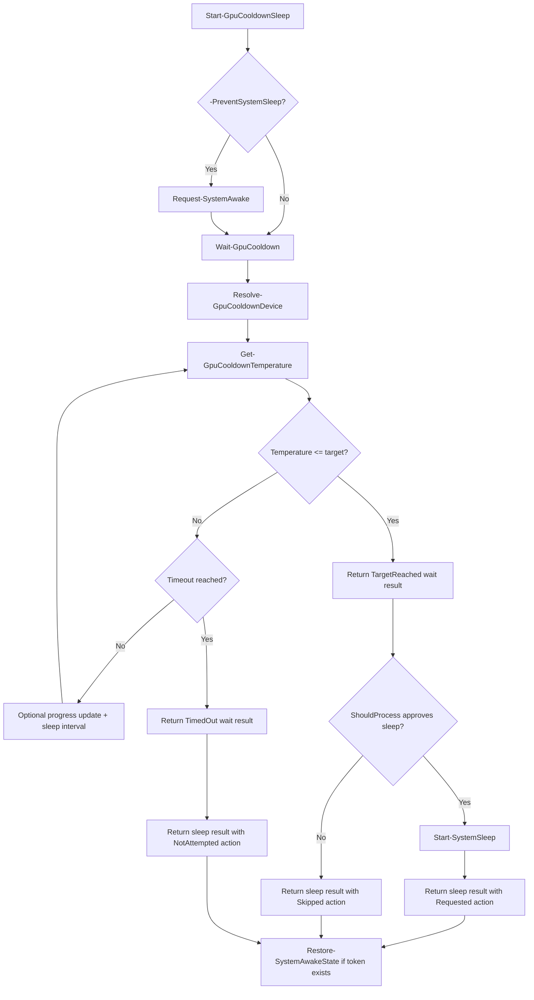

# Module Architecture Overview

This document explains how the `GpuCooldownSleep` module works today.

It is written primarily for portfolio reviewers who want to understand the module as a designed system rather than as a loose collection of PowerShell functions. It should also help future maintainers quickly orient themselves before making changes.

## Why This Helps As A Portfolio Project

For a portfolio reviewer, the most useful takeaway is that the repository demonstrates more than a clever one-off script.

The module shows:

- safe automation around system power state
- a clear public API instead of ad hoc script parameters
- provider-neutral shaping even in an NVIDIA-first implementation
- structured outputs suitable for automation and testing
- orchestration logic that is separated enough to unit test

That is the main reason an architecture overview adds value here: it makes the design work visible, not just the feature list.

## Why This Module Is Worth Mapping

The module solves a narrow problem, but it does so with a deliberate structure:

- a small public command surface
- provider-neutral object shapes
- orchestration separated from provider parsing
- explicit support checks before runtime work
- safe power-state handling through `ShouldProcess` and cleanup logic

That structure is part of the portfolio value of the repository. The code is not just polling a command-line tool and calling sleep. It is organized so that discovery, selection, polling, diagnostics, waiting, and sleep coordination can evolve without collapsing into a single script.

## Module Load And Export Model

The module entrypoint is `GpuCooldownSleep/GpuCooldownSleep.psm1`.

At import time, the module:

1. dot-sources every private helper from `GpuCooldownSleep/src/Private`
2. dot-sources every public command from `GpuCooldownSleep/src/Public`
3. registers argument completion through `Register-GpuCooldownArgumentCompleter`
4. exports the public function names discovered from the `Public` folder

This keeps the public surface small while letting the implementation stay modular.

The exported commands are:

- `Get-GpuCooldownDevice`
- `Get-GpuCooldownTemperature`
- `Wait-GpuCooldown`
- `Start-GpuCooldownSleep`
- `Test-GpuCooldownSupport`

## Public Workflow

The public commands are designed as a layered workflow rather than five unrelated entrypoints.

### 1. Environment Readiness

`Test-GpuCooldownSupport` checks whether the current environment can support the full workflow.

It combines:

- provider availability
- supported device discovery
- Windows sleep support
- temporary keep-awake support

It returns a structured summary instead of throwing for expected unsupported states.

### 2. Device Discovery

`Get-GpuCooldownDevice` asks the currently supported provider integrations for GPU devices and returns a normalized module-owned object shape.

Today, the implemented provider is NVIDIA via `nvidia-smi`, but the public output shape is intentionally vendor-neutral.

If exactly one supported device is found, it is marked as the default selection candidate.

### 3. Temperature Retrieval

`Get-GpuCooldownTemperature` resolves a device and retrieves its current temperature.

A device can be selected by:

- pipeline input from `Get-GpuCooldownDevice`
- `-DeviceId`
- `-Name`
- automatic selection when exactly one supported device is available

This command is where public device selection hands off to provider-specific telemetry retrieval.

### 4. Cooldown Monitoring

`Wait-GpuCooldown` builds on temperature retrieval to run a timeout-aware polling loop.

It:

- resolves the target device
- records start and timeout times
- repeatedly queries temperature
- optionally displays progress
- returns a structured result with either `TargetReached` or `TimedOut`

This command does not change system power state. It exists so the cooldown decision can be tested and understood separately from sleep orchestration.

### 5. Sleep Orchestration

`Start-GpuCooldownSleep` is the top-level orchestration command.

It:

- optionally requests temporary keep-awake behavior
- delegates waiting to `Wait-GpuCooldown`
- stops if the wait timed out
- only attempts sleep when the target was reached
- uses `ShouldProcess` before calling the sleep helper
- always restores keep-awake state in a `finally` block

This is the command that turns the lower-level pieces into a safe operational workflow.

## Runtime Flow

The same supporting pieces also enable smaller entrypoints:

- `Get-GpuCooldownTemperature` uses the same device resolution path without the wait loop
- `Wait-GpuCooldown` uses the same telemetry path without the sleep action
- `Test-GpuCooldownSupport` reports readiness without starting the workflow

## Public Output Contracts

The module returns structured objects at each stage. Those objects are the automation-facing contract.

### Normalized Device Object

`Get-GpuCooldownDevice` returns objects with these stable fields:

- `Provider`
- `Vendor`
- `Name`
- `DeviceId`
- `ProviderDeviceId`
- `PciBusId`
- `IsSupported`
- `IsSelectedByDefault`

This lets the module expose provider data without leaking raw `nvidia-smi` output into the public contract.

### Normalized Temperature Object

`Get-GpuCooldownTemperature` returns:

- `Provider`
- `Vendor`
- `Name`
- `DeviceId`
- `ProviderDeviceId`
- `PciBusId`
- `TemperatureCelsius`
- `RetrievedAt`

This keeps temperature retrieval machine-friendly and consistent with device discovery.

### Wait Result Object

`Wait-GpuCooldown` returns:

- `Provider`
- `Vendor`
- `Name`
- `DeviceId`
- `ProviderDeviceId`
- `PciBusId`
- `TargetTemperature`
- `FinalTemperatureCelsius`
- `Status`
- `StartedAt`
- `CompletedAt`
- `DurationSeconds`

Current `Status` values are:

- `TargetReached`
- `TimedOut`

### Sleep Result Object

`Start-GpuCooldownSleep` returns the wait result plus:

- `SleepAction`

Current `SleepAction` values are:

- `Requested`
- `Skipped`
- `NotAttempted`

This makes the sleep outcome explicit even when `-WhatIf` is used or when cooldown times out before any sleep attempt occurs.

## Private Helper Responsibilities

The private implementation is easier to understand when grouped by responsibility.

### Provider Integration And Parsing

These helpers isolate NVIDIA-specific behavior:

- `Get-NvidiaGpuCooldownDevice`
- `Get-NvidiaGpuCooldownTemperature`
- `ConvertFrom-NvidiaSmiDeviceLine`
- `ConvertFrom-NvidiaSmiTemperatureLine`
- `Get-GpuCooldownProviderSupportStatus`

They keep raw provider command handling out of the public commands.

### Device Resolution

These helpers turn discovery results into a single target device:

- `Get-GpuCooldownDeviceInternal`
- `Get-SupportedGpuCooldownDevicesSafely`
- `Resolve-GpuCooldownDevice`
- `Get-GpuCooldownDeviceDisplayName`
- `New-GpuCooldownDeviceObject`

This is what allows the module to support pipeline selection, stable IDs, friendly names, and single-device auto-selection without duplicating that logic everywhere.

### Wait And Result Construction

These helpers keep orchestration outputs consistent:

- `Get-GpuCooldownNow`
- `New-GpuCooldownWaitResultObject`
- `New-GpuCooldownSleepResultObject`

The result helpers are especially important because they define the stable object contracts returned to callers.

### Progress And Diagnostics

These helpers handle operator visibility:

- `Update-GpuCooldownProgress`
- `Clear-GpuCooldownProgress`
- `Write-GpuCooldownVerboseEvent`

The design keeps interactive progress and verbose diagnostics separate from the structured outputs returned to automation.

### Sleep And Keep-Awake Interop

These helpers isolate operating-system coordination:

- `Start-SystemSleep`
- `Test-GpuCooldownSleepSupport`
- `Request-SystemAwake`
- `Restore-SystemAwakeState`
- `Test-GpuCooldownKeepAwakeSupport`
- `Add-SystemAwakeInteropType`

This keeps Windows power-state handling away from the cooldown polling logic.

### Guardrails And UX Support

These helpers enforce readiness and improve command usage:

- `Assert-GpuCooldownMonitoringSupport`
- `Register-GpuCooldownArgumentCompleter`

These are small pieces, but they help make the public commands safer and easier to use.

## Behavioral Contracts That Matter

Several behaviors are important to understanding the module correctly:

- `Start-GpuCooldownSleep` uses `SupportsShouldProcess`, so sleep requests can be previewed with `-WhatIf`.
- `Wait-GpuCooldown` is intentionally non-mutating; it monitors and returns a result, but never changes system power state.
- `Start-GpuCooldownSleep` only attempts sleep when the wait result status is `TargetReached`.
- `-ShowProgress` is optional and interactive; it does not change the command output contract.
- `-Verbose` emits event-style diagnostics for operator confidence and troubleshooting.
- The current implementation is Windows-oriented for sleep behavior and NVIDIA-oriented for telemetry.

These are part of the module's design, not just incidental implementation details.

